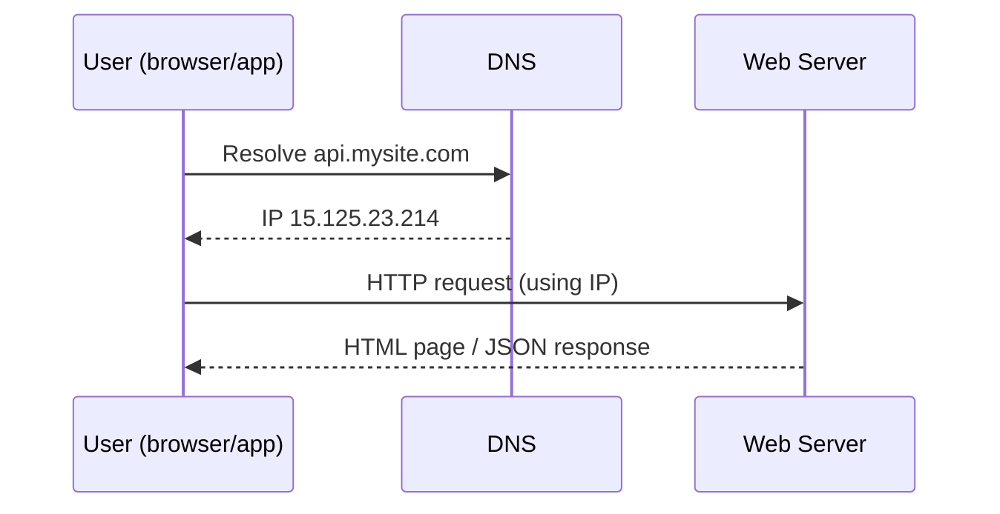
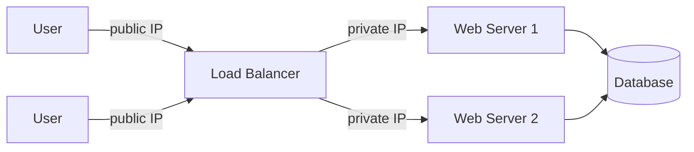
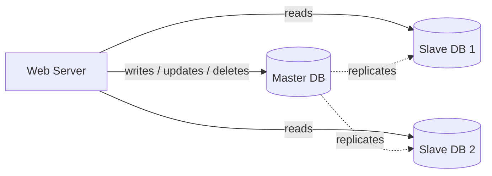
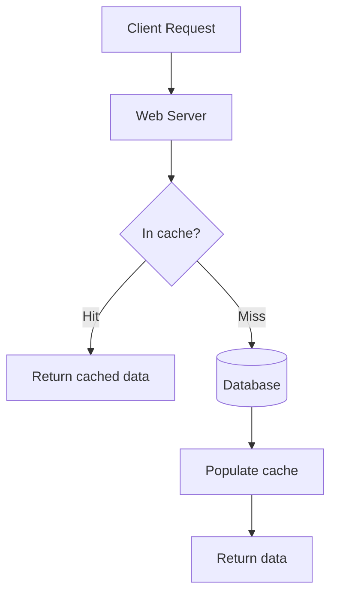
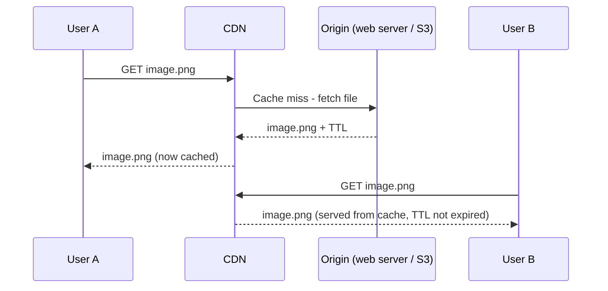
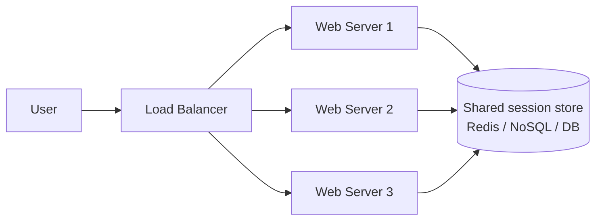
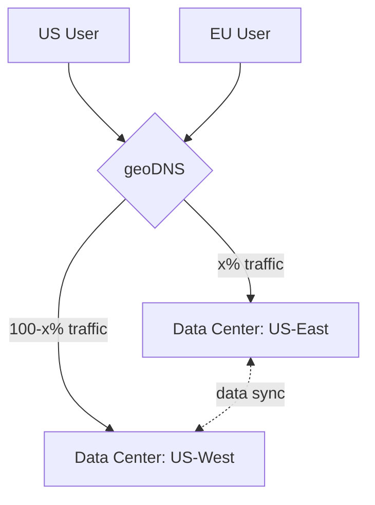
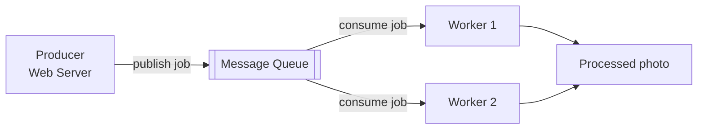
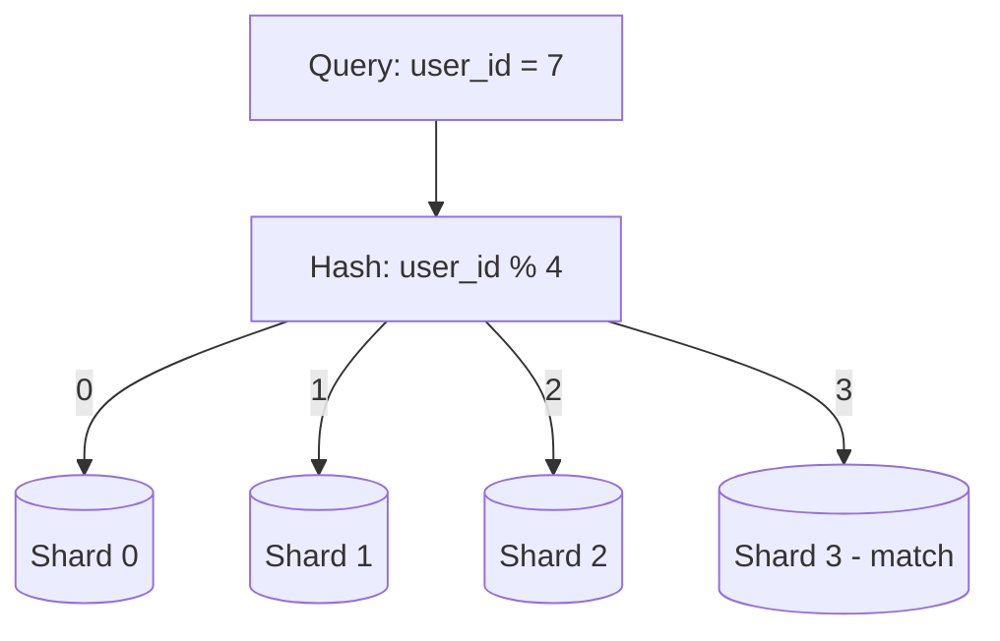

# Chapter 1: Scale From Zero to Millions of Users

Goal: start with a single server and evolve it, piece by piece, into an architecture that can serve millions of users. Each addition below solves a concrete pain point from the previous stage.

## 1. Single server setup

Everything (web app, database, cache) lives on one server.

**Request flow:**
1. User → DNS lookup for domain (e.g. `api.mysite.com`) → IP address returned. DNS is usually a paid 3rd-party service, not self-hosted.
2. Browser/app sends HTTP request directly to that IP (the web server).
3. Web server returns HTML or JSON.

**Traffic sources:**
- **Web app** — server-side (Java/Python/etc. for logic+storage) + client-side (HTML/JS for presentation).
- **Mobile app** — talks HTTP to the server; JSON is the typical response format.

## 2. Separate the database out

One server becomes two: a **web tier** and a **data tier** — so each can scale independently.

**SQL vs NoSQL**
| | Relational (SQL / RDBMS) | Non-relational (NoSQL) |
|---|---|---|
| Examples | MySQL, PostgreSQL, Oracle | DynamoDB, Cassandra, HBase, CouchDB, Neo4j |
| Structure | Tables + rows, supports JOINs | Key-value, document, column, graph stores; joins generally unsupported |
| Default choice | Yes — mature (40+ yrs), well understood | Use when SQL doesn't fit |

**Reach for NoSQL when:**
- You need super-low latency.
- Data is unstructured / has no relational structure.
- You just need to (de)serialize data (JSON/XML/YAML).
- You need to store massive volumes of data.

## 3. Vertical vs horizontal scaling

- **Vertical scaling ("scale up")** — add more CPU/RAM to one machine. Simple, but:
  - Hits a hard hardware ceiling.
  - No failover/redundancy — one box dying takes the whole app down.
- **Horizontal scaling ("scale out")** — add more machines. Preferred at scale.

## 4. Load balancer

Distributes incoming traffic across a pool of web servers.

- Users hit the load balancer's **public IP**; it talks to backend servers over **private IPs** (unreachable from the internet — better security).
- Solves two problems at once:
  - **Failover:** if server 1 dies, traffic reroutes to server 2; a new server is added back to the pool.
  - **Scale:** growing traffic → just add more servers behind the LB.

## 5. Database replication (master/slave)

- **Master** — handles writes (insert/update/delete).
- **Slave(s)** — copy data from master, handle reads only. Usually many more slaves than masters, since read:write ratio is typically high.

**Benefits:**
- **Performance** — reads and writes are parallelized across different nodes.
- **Reliability** — data survives a single server/data-center disaster because it's replicated elsewhere.
- **High availability** — the app stays up even if one DB node is offline.

**Failure handling:**
- Slave goes down → reads temporarily go to master (or another healthy slave) until a replacement slave is provisioned.
- Master goes down → a slave is promoted to master. Tricky in practice because the promoted slave's data may be stale; recovery scripts patch the gap. (Multi-master / circular replication exist but are out of scope here.)

## 6. Cache

A fast, temporary, in-memory store for expensive/frequent responses, sitting between the web tier and the DB.

**Read-through cache pattern:** web server checks cache first → hit: return cached data → miss: query DB, populate cache, return data.

**Design considerations:**
- **When to use** — good for read-heavy, write-light data. Cache is volatile (data lost on restart), so never treat it as the source of truth.
- **Expiration policy** — needed so data doesn't live forever/go stale. Too short → thrashes the DB with reloads. Too long → serves stale data.
- **Consistency** — cache and DB writes aren't in one transaction, so they can drift, especially across regions (see Facebook's "Scaling Memcache" paper).
- **Avoiding SPOF** — a single cache node is a single point of failure; run multiple cache nodes across data centers, and overprovision memory as a buffer.
- **Eviction policy** — when the cache is full: **LRU** (most common), also LFU, FIFO.

## 7. Content Delivery Network (CDN)

Geographically distributed servers caching **static** content (images, JS, CSS, video). Closer CDN edge server → faster load for the user.

**Flow:**
1. User requests `image.png` via a CDN-provided URL.
2. Cache miss → CDN fetches from the **origin** (web server or object storage like S3).
3. Origin returns the file with a **TTL** header.
4. CDN caches it and serves it; stays cached until TTL expires.
5. Subsequent users get it straight from the CDN cache.

**Considerations:**
- **Cost** — you pay for data transfer; don't cache rarely-used assets.
- **Cache expiry** — same too-long/too-short trade-off as regular caching.
- **CDN fallback** — app should detect CDN outages and fall back to the origin.
- **Invalidation** — either call the CDN vendor's invalidation API, or use **object versioning** (e.g. `image.png?v=2`) to force a fresh fetch.

After this step: static assets are served by the CDN, dynamic data reads are lightened by the cache layer.

## 8. Stateless web tier

- **Stateful server** — remembers client-specific data (e.g. session) between requests. Requires **sticky sessions** so a user always hits the same server → adds LB overhead, makes scaling/failure-handling harder.
- **Stateless server** — holds no session state itself; session data is moved to a **shared data store** (relational DB, Redis/Memcached, or NoSQL — NoSQL is common here for easy scaling).

**Payoff:** any server can handle any request → simple, robust **autoscaling** (add/remove web servers automatically based on load) becomes possible.

*Any server can serve any user — session state lives outside the web tier.*

## 9. Multiple data centers

Once traffic is international, a single data center isn't enough for availability/latency.

- **geoDNS / geo-routing** — routes users to their nearest data center (e.g. split x% US-East / (100-x)% US-West).
- **Failover** — if one data center goes down, all traffic is redirected to the healthy one(s).

**Challenges to solve:**
- **Traffic redirection** — GeoDNS routes to the nearest healthy data center.
- **Data synchronization** — different regions may have different local DBs/caches; a failover could route users to a data center missing their data. Common fix: replicate data across data centers (e.g. Netflix's async multi-DC replication).
- **Test & deployment** — need consistent, automated deployment across all data centers.

*If DC2 goes down, geoDNS routes 100% of traffic to DC1 (assuming data is replicated).*

## 10. Message queue

A durable, in-memory component enabling **asynchronous** communication and decoupling.

- **Producers/publishers** create and post messages to the queue.
- **Consumers/subscribers** read from the queue and act on messages.
- Producer and consumer don't need to be online simultaneously, and they **scale independently**.

**Example:** photo customization (crop/sharpen/blur) — web servers publish jobs to the queue; worker processes pull jobs and process them asynchronously. Queue backing up → add more workers; queue mostly empty → scale workers down.

*Producer and consumer are decoupled — neither needs the other online at the same time, and each scales independently.*

## 11. Logging, metrics, automation

Not critical for a small site, essential once the business is large.

- **Logging** — monitor error logs per-server or aggregate centrally for easier search/analysis.
- **Metrics** — gives business + system-health insight:
  - Host-level: CPU, memory, disk I/O.
  - Aggregated: performance of the whole DB tier, cache tier, etc.
  - Business: DAU, retention, revenue.
- **Automation** — CI (every check-in auto-verified) + automated build/test/deploy pipelines to catch problems early and boost productivity.

## 12. Database scaling

### Vertical scaling
Bigger single DB server (e.g. AWS RDS instances with up to 24 TB RAM). Simple, and sometimes sufficient (Stack Overflow ran on one master DB in 2013 with 10M+ monthly uniques). Drawbacks:
- Hardware ceiling.
- Bigger SPOF risk.
- Expensive.

### Horizontal scaling = Sharding
Split one large DB into smaller **shards**, each holding a unique slice of the data but sharing the same schema.

- A **hash function** on the **sharding key** (a.k.a. partition key) routes each query to the right shard — e.g. `user_id % 4`.
- **Choosing a good sharding key:** the most important property is that it distributes data **evenly** across shards.

**New problems sharding introduces:**
- **Resharding** — needed when a shard fills up, or when uneven distribution causes some shards to fill faster than others ("shard exhaustion"). Requires changing the hash function and moving data. **Consistent hashing** (Chapter 5) is the standard fix.
- **Celebrity / hotspot key problem** — heavy access concentrated on one shard's key (e.g. a few celebrities' social data landing on the same shard) can overload that shard. Fix: dedicate a shard per hot key, and further partition if needed.
- **Joins & denormalization** — cross-shard joins are hard/impossible; common workaround is denormalizing data so a query only needs a single table.

## Summary checklist — scaling to millions of users

- Keep the web tier **stateless**
- Build **redundancy** at every tier
- **Cache** data as much as possible
- Support **multiple data centers**
- Host static assets on a **CDN**
- Scale the data tier via **sharding**
- **Split tiers into individual services** (hints at microservices, expanded later in the book)
- **Monitor** the system and lean on **automation**

## My open questions / follow-ups
- *(add doubts here as they come up)*
