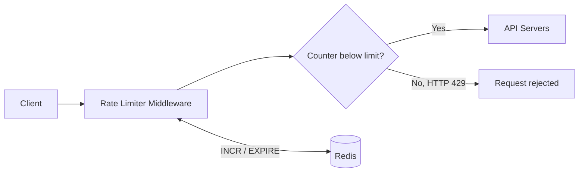
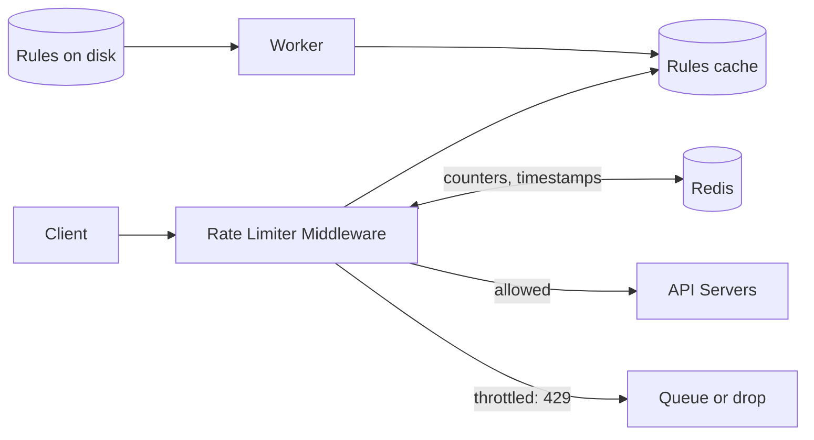
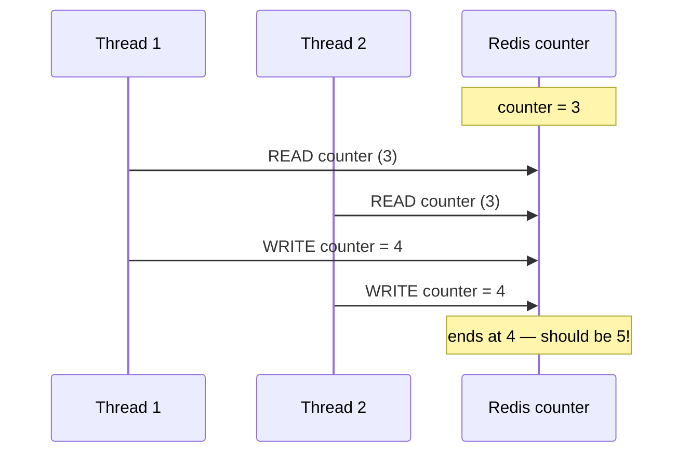
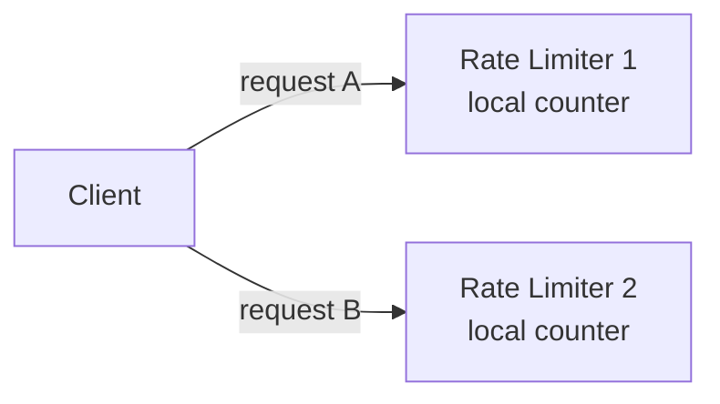
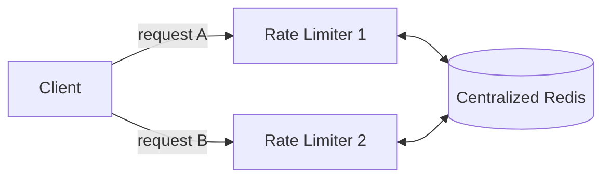

# Chapter 4: Design a Rate Limiter

A rate limiter controls how much traffic a client or service can send in a given period. Exceed the threshold → excess calls get blocked. Examples: "max 2 posts/second," "max 10 accounts/day from the same IP," "max 5 reward claims/week from the same device."

**Why rate limit?**
- **Prevent resource starvation from DoS attacks** — intentional or not. Twitter caps tweets at 300/3h; Google Docs API caps reads at 300/user/60s.
- **Reduce cost** — fewer servers needed, and critical when paying per-call for third-party APIs (credit checks, payments, health records).
- **Prevent server overload** — filters out excess requests from bots or misbehaving clients.

## Step 1 — Requirements

Clarifying conversation lands on: **server-side API rate limiter**, flexible enough to throttle by IP/user ID/other properties, built for large scale, works in a **distributed environment**, design decision on whether it's a separate service vs in-app, and throttled users must be informed.

**Requirements summary:**
- Accurately limit excessive requests.
- Low latency — must not slow down HTTP response time.
- Minimal memory use.
- Works across multiple servers/processes (distributed).
- Clear exceptions shown to throttled users.
- High fault tolerance — if the rate limiter's cache goes down, the rest of the system keeps working.

## Step 2 — High-level design

### Where does the rate limiter live?

- **Client-side** — generally unreliable. Requests can be forged, and you often don't control the client.
- **Server-side** — placed on the API server itself, or as **middleware** in front of it.

A common industrial pattern: an **API gateway** — a fully-managed middleware layer that handles rate limiting, SSL termination, auth, IP whitelisting, static content, etc.

**Server-side vs. gateway — depends on:**
- Your current tech stack (is your language efficient for this?).
- How much control you need over the algorithm — full control on your own server, potentially limited by a third-party gateway.
- Whether you already run a microservice/API-gateway architecture — if so, bolt it on there.
- Engineering resources available — building your own takes time; a commercial gateway is faster to adopt.


*Fig 4-12 — High-level rate limiting architecture*

**Example:** API allows 2 req/sec; client sends 3 within a second → first two pass through, the third is throttled and gets **HTTP 429 Too Many Requests**.

## Algorithms

| Algorithm | Mechanism | Params | Pros | Cons |
|---|---|---|---|---|
| **Token bucket** | Bucket holds up to N tokens, refilled at a fixed rate; each request consumes 1 token; empty bucket → request dropped | bucket size, refill rate | Simple, memory-efficient, allows short bursts | Two params can be tricky to tune |
| **Leaking bucket** | FIFO queue; requests join the queue if not full, else dropped; pulled and processed at a fixed outflow rate | bucket (queue) size, outflow rate | Memory-efficient, stable fixed outflow rate | A traffic burst fills the queue with old requests, starving recent ones; two params to tune |
| **Fixed window counter** | Timeline split into fixed windows, each with its own counter; counter resets each new window | window size, threshold | Memory-efficient, easy to understand | Traffic spikes **at window edges** can let through up to 2× the allowed quota |
| **Sliding window log** | Keeps every request timestamp (e.g. in a Redis sorted set); on each request, drop timestamps older than the window, then check log size vs. limit | window size, limit | Very accurate — never exceeds the limit in any rolling window | Memory-heavy — even rejected requests' timestamps may linger |
| **Sliding window counter** | Hybrid: weights the previous window's count by the overlap % with the current rolling window, adds to current window's count | window size, limit | Smooths traffic spikes, memory-efficient | Approximation — assumes previous-window requests were evenly distributed (in practice, Cloudflare found only ~0.003% of requests were mis-handled across 400M requests) |

**Token bucket** is the most widely used (Amazon, Stripe use it). **Leaking bucket** is used by Shopify.

### The fixed-window edge problem, visualized

System allows 5 requests/minute. 5 requests land in `[2:00:00, 2:01:00)`, another 5 in `[2:01:00, 2:02:00)` — each window individually compliant. But the **rolling** 1-minute window `[2:00:30, 2:01:30)` contains all 10 — twice the allowed quota. This is exactly what sliding window log/counter fix.

### Sliding window counter — worked example

Rate limiter allows 7 req/min. Previous minute had 5 requests, current minute has 3 so far. A new request arrives at the 30% mark of the current minute:

```
requests in rolling window = current window count + previous window count × overlap %
                            = 3 + 5 × 0.7
                            = 6.5  →  rounded down to 6
```
6 < 7, so the request is allowed — but the limit will be hit after just one more.

### How many buckets/counters do you need?

- Usually **one per API endpoint per user** (e.g. separate limits for posting, adding friends, liking).
- **Per IP address** if throttling by IP.
- A **global bucket** if there's a system-wide cap (e.g. max 10,000 req/sec overall).

### Where to store counters

Not the database — disk access is too slow. **In-memory cache** (Redis is the common choice) using:
- `INCR` — increments the stored counter by 1.
- `EXPIRE` — sets a timeout after which the counter auto-deletes.

## Step 3 — Design deep dive

### Rate limiting rules

Often stored as config files on disk (Lyft open-sourced their rate-limiting component as a reference). Example rule:
```yaml
domain: messaging
descriptors:
  - key: message_type
    Value: marketing
    rate_limit:
      unit: day
      requests_per_unit: 5
```
→ max 5 marketing messages/day.

### Exceeding the limit

Return **HTTP 429**. Depending on the use case, rate-limited requests can be enqueued for later processing instead of dropped outright (e.g. orders throttled due to system overload).

### Rate limiter response headers

| Header | Meaning |
|---|---|
| `X-Ratelimit-Remaining` | Remaining allowed requests in the current window |
| `X-Ratelimit-Limit` | Max calls allowed per window |
| `X-Ratelimit-Retry-After` | Seconds to wait before retrying without being throttled |

### Detailed design (Fig 4-13)


Workers periodically pull rules from disk into a cache the middleware reads from. The middleware checks Redis counters/timestamps to decide allow vs. throttle.

## Rate limiter in a distributed environment

Single-server rate limiting is easy. Multi-server introduces two problems.

### 1. Race condition

Naive flow: read counter → check if `counter + 1` exceeds threshold → write `counter + 1` back.



Two concurrent requests both read `3`, both compute `4`, both write `4` — the correct value was `5`. **Locks** fix this but slow the system down significantly. Common alternatives: **Lua scripting** (atomic execution) and Redis **sorted sets**.

### Understanding the concurrency fixes (the book only names these — here's the mechanism)

The core trick behind every fix below is the same: **don't prevent concurrency, eliminate the gap where it matters** — turn the check-and-update into a single indivisible operation on Redis's side, so there's no window for a second request to interleave. Redis executes commands **single-threaded**, which is what makes all of this possible: whatever atomic unit you send it (one command, or one Lua script) runs to completion before Redis looks at any other client's request.

**Fix 0 — just use `INCR`, not `GET`+`SET`.** For the plain fixed-window counter, you don't need Lua at all. `INCR` is *itself* atomic — it increments and returns the new value in one indivisible step:
```
newVal = INCR(counter_key)                          # atomic — no stale read possible
if newVal == 1: EXPIRE(counter_key, window_size)     # set TTL only on the first hit
if newVal > limit: reject else: allow
```
There's no separate `GET`, so there's nothing for a second thread to race against. This is why Chapter 4's "where to store counters" section specifically named `INCR` and `EXPIRE` — `INCR` already solves the race for the simplest algorithm. The book's race-condition example is really describing someone reinventing `INCR` badly with a manual `GET` → compute → `SET`.

**Fix 1 — Lua scripting, for when one command isn't enough.** Token bucket and sliding window counter need to read *and* write several related pieces of state together (current tokens, elapsed time, refill amount) — no single Redis command covers that. The fix: ship the entire check-and-update logic to Redis as one Lua script via `EVAL`. Because Redis runs a script to completion as one atomic unit, two concurrent requests against the same key can never both observe "tokens > 0" for the last remaining token — Redis queues the second script until the first fully finishes, so it sees the already-decremented value.
```lua
-- token bucket check, runs atomically inside Redis
local tokens = tonumber(redis.call('GET', KEYS[1]) or ARGV[1])
if tokens > 0 then
  redis.call('DECR', KEYS[1])
  return 1   -- allowed
else
  return 0   -- rate limited
end
```

**Fix 2 — sorted sets, the data structure for sliding-window-log (not a concurrency fix by itself).** A sorted set (ZSET) is the right shape for "keep every request timestamp, drop stale ones, count what's left": `ZADD` to record a request, `ZREMRANGEBYSCORE` to drop timestamps outside the window, `ZCARD` to count survivors. Each command is individually atomic, but running all three as separate round-trips reopens the *exact same race* — another client's `ZADD` can land between your `ZREMRANGEBYSCORE` and your `ZCARD`. So sorted sets are always **paired with** a Lua script or a Redis transaction (`MULTI`/`EXEC`) that bundles the three calls into one atomic unit. The sorted set gives you the right data shape; Lua/transactions give you the atomicity — the book compresses these into one bullet, but they solve two different problems.

**Why not just use a lock?** It works (acquire lock → GET → check → SET → release), but rate-limit checks run on *every* API request — the hottest possible path. Every check now pays for a lock round-trip on top of the actual work, and if a process crashes while holding the lock, every subsequent request blocks until the lock times out — a rate limiter bug becomes a full outage. Atomic server-side operations sidestep this: there's no lock to acquire or fail to release, because the whole read-check-write happens as one step *inside* Redis.

### 2. Synchronization issue

Since the web tier is stateless, the *same* client's requests can land on different rate limiter instances. Without shared state, each instance's local counter is blind to the others.


*Fig 4-15 — no synchronization: each instance only sees its own traffic*

**Sticky sessions** (always route a client to the same instance) are not advisable — not scalable or flexible. The fix is a **centralized data store**:


*Fig 4-16 — a shared Redis store keeps every instance consistent*

## Performance optimization

- **Multi-data-center setup** — latency is high for users far from the data center; route traffic to the nearest edge server (Cloudflare had 194 edge locations as of 5/2020).
- **Eventual consistency** for data sync between rate limiter nodes (see Chapter 6's "Consistency" section).

## Monitoring

After deployment, check:
- Is the **algorithm** effective?
- Are the **rules** effective?

If rules are too strict, valid requests get dropped unnecessarily — relax them. If the rate limiter becomes ineffective during traffic spikes (e.g. flash sales), consider an algorithm that tolerates bursts better — **token bucket** is a good fit here.

## Step 4 — Wrap up / additional talking points

- **Hard vs. soft rate limiting** — hard: requests can never exceed the threshold; soft: requests can exceed it briefly.
- **Rate limiting at different OSI layers** — this chapter covers **layer 7** (application/HTTP). It's also possible to rate limit at **layer 3** (network) using tools like Iptables, by IP address.
- **Designing clients to avoid being rate limited:**
  - Cache client-side to avoid unnecessary repeat calls.
  - Understand the limit; don't burst requests in a short window.
  - Catch exceptions/errors so the client can recover gracefully.
  - Add sufficient backoff time to retry logic.

## My open questions / follow-ups
- *(add doubts here as they come up)*
