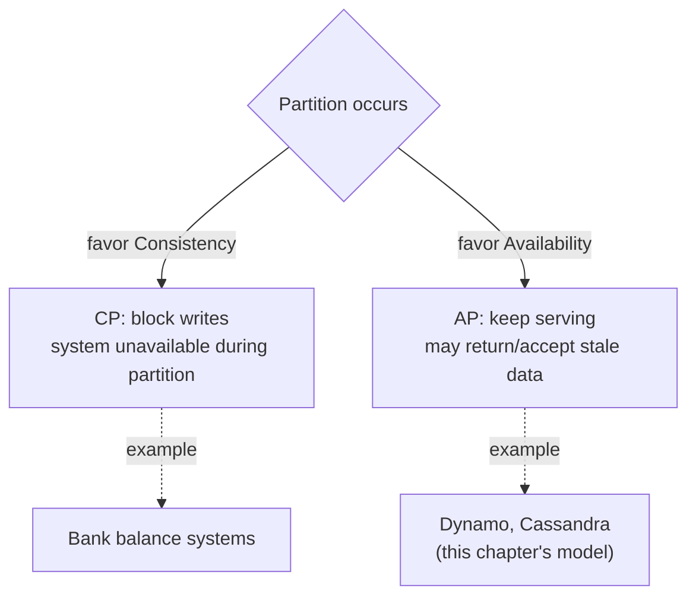
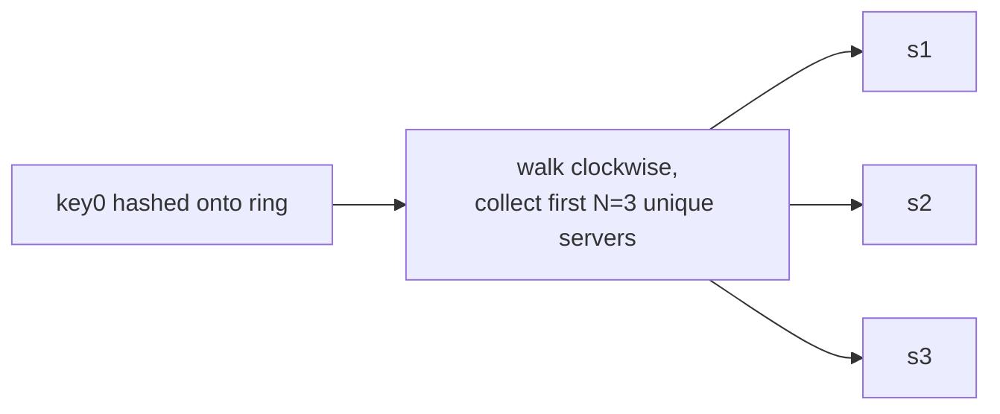
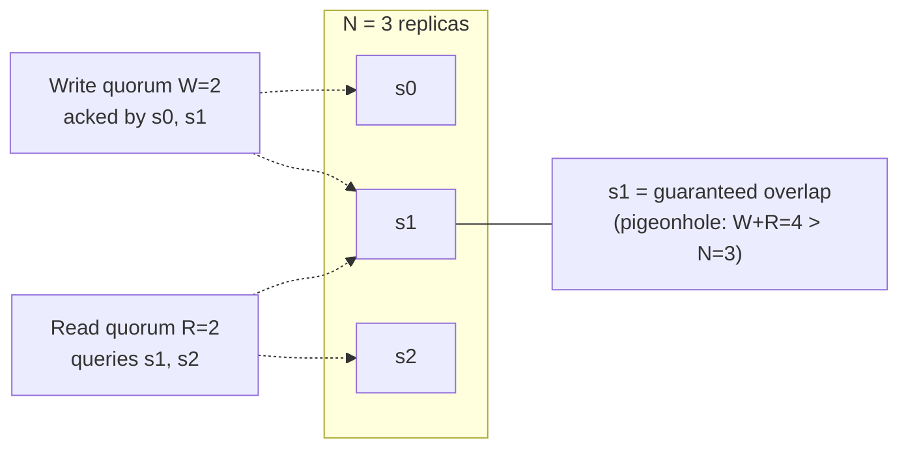
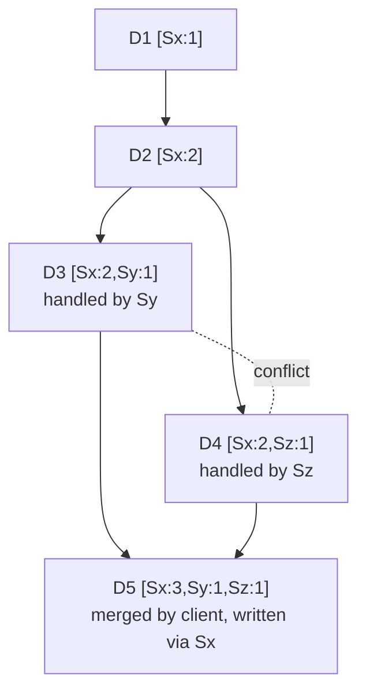
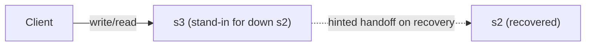
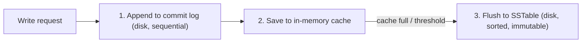
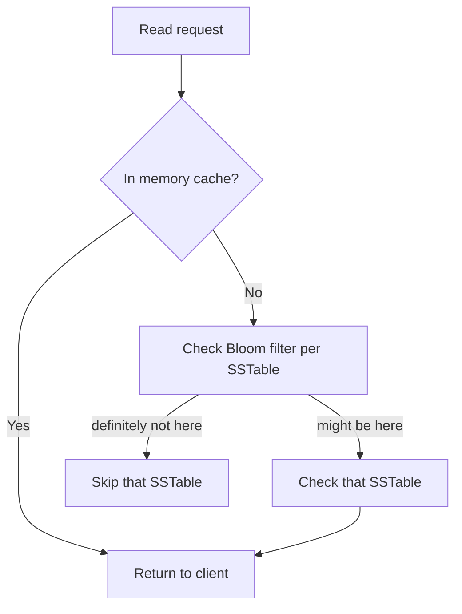

# Chapter 6: Design a Key-Value Store

A key-value store is a non-relational database: each unique **key** maps to an opaque **value** (string, list, object — the store doesn't inspect it). The whole design in this chapter is scoped to exactly two operations:
```
put(key, value)
get(key)
```
That narrow scope (Chapter 3's scoping skill in action) is what makes consistent hashing such a clean fit — pure key→node routing is the entire access pattern, no joins, no range queries, no secondary indexes.

**Design goals for this chapter's system:** KV pairs < 10 KB, ability to store big data, high availability (responds quickly even during failures), high scalability, automatic scaling (servers added/removed without manual intervention), tunable consistency, low latency.

## 1. Single server key-value store

A hash table in memory is the obvious starting point — fast, but memory-bound. Two patches (compression, keep-hot-in-memory/rest-on-disk) buy some headroom, but a single server hits a hard ceiling on raw **dataset size**. This is a different scaling trigger than QPS-based limits — the constraint here is data volume exceeding one machine's memory/disk, which is what forces the move to a distributed design.

## 2. CAP theorem — the foundation everything else is built on

**Definitions:**
- **Consistency** — every client sees the same data at the same time, regardless of which node it talks to.
- **Availability** — every request gets a response, even if some nodes are down.
- **Partition tolerance** — the system keeps working despite a communication break between nodes.

**The theorem:** a distributed system cannot fully guarantee all three at once.

**The practical reframing:** network partitions are not optional — they *will* happen in any real distributed system. So partition tolerance isn't a choice you get to opt out of; it's a fact of life. This is exactly why a **CA system cannot exist in real-world distributed applications** — "sacrificing partition tolerance" really means "this only works as long as nothing ever goes wrong," which isn't a distributed system. The theorem's real, practical form: **when a partition happens (not if), do you block to stay consistent, or keep serving and risk staleness?**

**Worked example** (data replicated on `n1, n2, n3`; `n3` gets cut off from `n1`/`n2`):
- **CP (favor consistency)** — block writes on `n1`/`n2` until the partition heals, so nobody ever sees divergent data. The system becomes unavailable for those writes. Right call for a bank — an error beats a wrong balance.
- **AP (favor availability)** — keep accepting reads/writes on both sides, even though they'll diverge, and reconcile once the partition heals. The system stays up but can serve/accept stale data meanwhile.

**System classification:**
- **CP** system: consistency + partition tolerance, sacrifices availability.
- **AP** system: availability + partition tolerance, sacrifices consistency.
- **CA** system: doesn't really exist for genuinely distributed systems (see above).

**The thread that runs through the whole rest of the chapter:** Dynamo and Cassandra (this chapter's reference systems) choose **AP**. Every remaining topic is either *implementing* that AP choice, or *cleaning up the mess AP creates* (concurrent writes needing reconciliation).



## 3. Data partitioning (consistent hashing, revisited)

Same ring mechanism as Chapter 5 — solves "how do I split a dataset too big for one machine across many machines." One addition this chapter makes:

**Heterogeneity.** Real clusters have mixed hardware. The number of virtual nodes a server gets is made **proportional to its capacity** — a server with 2× the RAM/disk of another gets roughly 2× the virtual nodes, so it owns roughly 2× the ring and receives roughly 2× the load, matched to what it can actually handle.

*(Reminder: a virtual node is not a separate running server — it's an extra label/position on the ring that resolves back to the same physical machine, purely a lookup-table trick to improve the ring's statistical fairness. Adding a new physical server is never blocked by existing virtual nodes — you just compute new hash positions and insert them.)*

## 4. Data replication

Partitioning alone gives one owner per key — a single point of failure. Replication stores each key on **N** servers instead of one.

**Placement:** walk clockwise from the key's ring position, pick the first **N unique physical servers** encountered — "unique" matters because virtual nodes can make several consecutive ring positions resolve to the same physical machine, and naively taking N *positions* could replicate to fewer than N actual servers.

**Cross-data-center placement:** failures are often correlated — a power outage or network failure tends to take out a whole data center, not one server in isolation. Replicating only within one DC buys no protection against that. Real systems spread the N replicas across physically distinct data centers connected by high-speed links, trading some latency for real fault isolation. (This is the seed of "handling data center outage," topic 8d.)

**One detail that sets up the next topic:** replication is **asynchronous** — a write doesn't need all N replicas to confirm before being "done." That raises: how many of the N actually need to agree, and when? → quorum consensus.



## 5. Consistency — quorum consensus (N, W, R)

**Definitions:**
- **N** — number of replicas.
- **W** — write quorum: a write succeeds once **W** replicas acknowledge it.
- **R** — read quorum: a read succeeds once **R** replicas have responded.

**Kill this misconception immediately:** `W = 1` does **not** mean data is written to only one server. The write still goes toward all N replicas — `W=1` just means the **coordinator** (a proxy node between client and replicas) only waits for the *first* ack before telling the client "success."

**Latency/consistency knob:** low W or R → fast (coordinator returns as soon as the first response arrives). High W or R → slower (coordinator waits for the *slowest* of however many it's waiting on) but stronger guarantees.

**The formula: `W + R > N` guarantees strong consistency.** Why — a pigeonhole argument: if a write only needs W acks, the "fresh" copy could live on any W-sized subset of the N replicas. If a read only needs R responses, it queries some R-sized subset. If `W + R > N`, those two subsets are **mathematically guaranteed to overlap** by at least one replica — there aren't enough "other" replicas for them to be fully disjoint. That overlapping replica is guaranteed to hold the latest write.

**Worked example**, N=3 (`s0, s1, s2`):
- `W=2, R=2` (4 > 3): write acked by `{s0,s1}`; read queries `{s1,s2}`. Overlap = `{s1}` → guaranteed fresh. **This is why N=3, W=R=2 is the commonly cited default.**
- `W=1, R=1` (2 ≤ 3): write acked by `{s0}`; read queries `{s2}`. No overlap guaranteed — the read could return fully stale data with no indication anything's wrong.

**Common configurations:**
| Config | Optimized for | Cost |
|---|---|---|
| `R=1, W=N` | Fast reads | Slow writes (wait for every replica) |
| `W=1, R=N` | Fast writes | Slow reads |
| `W+R > N` (e.g. N=3, W=R=2) | Strong consistency | Balanced but not cheap on either side |
| `W+R ≤ N` | Lowest latency | No consistency guarantee |



### What quorum consensus tells a system architect

1. **Consistency becomes a per-workload dial, not a global binary property.** The same replication machinery can back both a strongly-consistent path and a loosely-consistent path, just by choosing different N/W/R per key or table.
2. **It separates two different concerns**: N controls fault tolerance/durability (how many failures can I survive), while W and R (relative to N) control the latency/staleness tradeoff — independently tunable.
3. **It tells you where to pay the latency cost, matched to actual traffic shape**: read-heavy workloads want small R (pay the cost once on the rarer write path); write-heavy workloads want small W.
4. **It's a provable guarantee, not a hand-wave** — `W+R>N` can be defended mathematically, not just asserted as "probably fine."
5. **Bigger quorums expose you to tail latency**: waiting on R replicas means your response time is governed by the *slowest* of them, not the average — a classic "tail at scale" cost. This is part of why N=3, W=R=2 (the minimum that satisfies the formula) is preferred over maxing out W/R "for extra safety."

## 6. Consistency models

- **Strong consistency** — any read returns the most recent write. A client never sees stale data.
- **Weak consistency** — a subsequent read may not reflect the most recent write.
- **Eventual consistency** — a specific case of weak consistency: if writes stop, given enough time, all replicas converge.

**How strong consistency is achieved, and why it's expensive:** force a replica to refuse new reads/writes until every replica agrees on the current value — blocking until full propagation. This is quorum consensus pushed to its extreme (`W=N, R=N`) — literally the CP choice from CAP theorem, made concrete. **Dynamo and Cassandra default to eventual consistency instead**, and this chapter recommends the same for a general-purpose, highly-available KV store.

**Quorum settings and the consistency model they produce are the same knob, viewed two ways:**
| Quorum setting | Consistency model |
|---|---|
| `W=N, R=N` (or full blocking) | Strong, worst availability/latency |
| `W+R>N`, both `<N` (e.g. N=3, W=R=2) | Strong, without needing every replica |
| `W+R≤N` | Weak/eventual, best availability/latency |

**The crucial nuance**: eventual consistency does **not** mean "it fixes itself, don't worry." It means *if writes stop*, replicas converge — it says nothing about what a read sees *during* concurrent writes, and the system does not automatically pick a winner among conflicting concurrent writes. That's exactly the motivation for vector clocks.

## 7. Inconsistency resolution — vector clocks

**Why not just use timestamps?** Server clocks aren't perfectly synchronized (clock skew is real) — a genuinely later write can carry an earlier timestamp, so naive "last write wins" can silently keep the wrong version and lose data with no warning. Vector clocks use a **logical** clock instead — tracking *who processed what*, not *when*.

### The mechanism, built up from scratch

A vector clock is a paper trail: `D([Sx,2],[Sy,1])` means "this version's history includes 2 writes processed by Sx, 1 by Sy." Every time a server handles a write for a key, it bumps **its own** counter by one (adding itself with counter 1 if it's never touched this key before) — it never touches another server's counter.

**Case 1 — one server, no branching:**
```
D1 written by Sx → D1 = [Sx:1]
D2 (edit of D1), also by Sx → D2 = [Sx:2]
```
2 ≥ 1 → D2 cleanly descends from D1. Only one lineage, nothing to branch from.

**Case 2 — a second server joins, still no branching:**
```
D2 read and updated to D3, handled by Sy → D3 = [Sx:2, Sy:1]
```
A server touching the lineage for the first time adds itself with counter 1, keeping everything it inherited. Still one unbroken line, now spanning two servers.

**The general rule so far:** Y descends from X (no conflict) if, for every server, Y's counter ≥ X's counter (treat a missing entry as 0).

**Case 3 — an actual fork.** Two different clients read the *same* version `D2=[Sx:2]` at roughly the same time, before either writes back:
```
Client A updates D2 → D3, handled by Sy → D3 = [Sx:2, Sy:1]
Client B updates D2 → D4, handled by Sz → D4 = [Sx:2, Sz:1]
```
Both carry `Sx:2` (their shared starting point), but neither knows about the other's addition.

Check both directions:
- Does D3 descend from D4? `Sx: 2≥2` ✓, `Sy: 1≥0` ✓, `Sz: 0≥1` **✗** — fails.
- Does D4 descend from D3? `Sx: 2≥2` ✓, `Sz: 1≥0` ✓, `Sy: 0≥1` **✗** — fails.

**Neither direction passes — that failure in both directions *is* the definition of a conflict.** It's not a separate rule, it falls directly out of applying the ancestor check twice.

**Rules, summarized:**
- **Descends from (no conflict):** every one of Y's counters ≥ the corresponding counter in X.
- **Conflict (siblings):** the check fails both ways — X leads on some server, Y leads on a different one.

### Resolving the fork — the merge, and the client's role

1. **A read returns *all* conflicting siblings, not a silently-picked winner.** `get(key)` on conflicting versions returns every sibling along with its vector clock.
2. **The client applies domain-specific merge logic to the actual values.** The vector clock only proves a conflict exists — it says nothing about what the merged content should be. That's application logic (e.g. "union of cart items, never drop an add").
3. **The client writes the merge back, passing along the vector clocks ("context") of every version it merged.** This is how the client tells the server "this new value supersedes *these specific* prior versions."
4. **The server builds the new clock**: take the max of each server's counter across all merged parents, then increment its own counter on top.
5. **Resolved going forward**: the new version's clock now dominates every former sibling, so future reads see a clean, unambiguous descendant.

**Worked example** (shopping cart, continuing D3/D4 from above):
```
D3 = {apple, banana}   clock [Sx:2, Sy:1]
D4 = {apple, cherry}   clock [Sx:2, Sz:1]

client reads both → merges via "union" → {apple, banana, cherry}
client writes back with context = [D3's clock, D4's clock]
server (say Sx) computes: max(Sx:2,2)=2, max(Sy:1,0)=1, max(Sz:0,1)=1, then increments itself
→ D5 = {apple, banana, cherry}, clock [Sx:3, Sy:1, Sz:1]
```
D5 now dominates both D3 and D4 — conflict resolved.



**Terminology note:** "client" usually means the application/business-logic layer, not necessarily a human — merges can be fully automatic (union of items) or, for genuinely ambiguous data, surfaced all the way to a human to choose.

**Two real costs:**
1. The client must implement conflict-resolution logic — the store can detect a conflict but has no domain knowledge to resolve it.
2. Vector clocks can grow unboundedly as more distinct servers touch a long-lived key. Fix: cap the length, drop the oldest entries — can make old-history comparisons slightly inaccurate, but per the Dynamo paper, not a real production problem for Amazon.

### What vector clocks tell an engineer

1. **Eventual consistency isn't free — this is where you see the bill.** Choosing AP means signing up to build and maintain conflict-resolution logic somewhere.
2. **Never trust wall-clock time to order events across machines** — use logical/causal ordering (vector clocks, Lamport timestamps) instead. This generalizes well beyond this chapter.
3. **The storage layer can detect a conflict; it can never resolve one for you** — resolution is inherently domain-specific.
4. **This should shape data modeling**: prefer naturally mergeable structures (sets, counters, append-only logs — the idea behind CRDTs) over single mutable fields with no clear merge rule.
5. **The general principle**: push ambiguous decisions to the edges (client/application, which understands the domain); keep the core storage system simple, fast, and available.

## 8. Handling failures — an escalation ladder

### 8a. Failure detection — gossip protocol

**Why not trust one node's claim alone?** A single node saying "X is down" could just reflect *its own* flaky link — you need independent corroboration.

**Naive: all-to-all multicasting** — every node pings every other node directly. Doesn't scale (~n² messages).

**Gossip protocol** (decentralized):
1. Each node keeps a membership list: `{member_id → heartbeat_counter}`.
2. Each node periodically bumps its own heartbeat.
3. Each node periodically sends its list to a small set of **random** peers.
4. Recipients merge the incoming info, then gossip onward to their own random peers — info spreads virally through the cluster.
5. If a member's heartbeat hasn't advanced past a threshold, it's marked offline, and that news spreads the same way.

**Example:** `s0` notices `s2`'s heartbeat is stale, gossips this to random peers; if they independently confirm it, `s2` gets marked down and the news propagates further.

### 8b. Handling temporary failures — sloppy quorum + hinted handoff

Strictly requiring the literal N *designated* replicas would stall operations if one happens to be down — undermining the whole AP choice.

**Sloppy quorum:** instead of insisting on the original N servers, walk the ring and take the first **W healthy** servers for a write (or **R healthy** for a read), skipping any currently marked down.

**Hinted handoff:** a healthy stand-in server remembers ("hints") that data it's temporarily holding really belongs to a down replica. Once that replica recovers, the stand-in hands the accumulated changes back. Example: `s2` down → `s3` temporarily serves its reads/writes → `s2` recovers → `s3` pushes the data over.



### 8c. Handling permanent failures — anti-entropy via Merkle trees

Hinted handoff assumes the down node comes back. If it doesn't (or replicas silently drift without ever being flagged "down"), a periodic **anti-entropy** check is needed: are these replicas actually identical, and if not, fix only what differs.

**Why naive comparison is too expensive:** comparing every key between two replicas means transferring/comparing the whole dataset — untenable at billions of keys.

**Why one big hash isn't enough either:** hashing the whole dataset into one value per replica gives a cheap match/no-match check, but tells you nothing about *which* key is wrong if they don't match.

**Merkle tree — hierarchical hashing to localize the difference:**
1. Divide the key space into **buckets** (caps tree depth regardless of total key count).
2. Hash every key within a bucket.
3. Combine into one hash per bucket.
4. Build upward — each parent = hash of its children's hashes — up to one **root hash**.

**Worked example**, keys 1-8 in 4 buckets of 2, where replica B is missing key 6:
```
                Root
              /      \
           H12        H34
          /   \      /   \
        H1    H2   H3    H4
       {1,2} {3,4} {5,6} {7,8}
```
- Compare roots → **differ** (something's wrong, location unknown).
- Compare `H12` → **match** (buckets 1-2 fully cleared, never look inside). Compare `H34` → **differ**.
- Compare `H3` → **differ**. Compare `H4` → **match** (cleared).
- Only now compare individual keys in bucket 3 → key 5 matches, **key 6 differs**. Found it.

**Why this scales:** the actual data compared is proportional to the *difference* between replicas, not total dataset size. Book's real config: ~1 million buckets per 1 billion keys (~1,000 keys/bucket) — localizing a divergence costs ~20 hash comparisons plus scanning one ~1,000-key bucket, not a billion keys.

**Why buckets, not one leaf per key:** a leaf per key would mean a billion leaf nodes to store/maintain. Bucketing is a real tradeoff — bigger buckets mean a smaller tree but more scanning once localized; smaller buckets mean more precision but a bigger tree.

**The repair step**: once the differing key(s) are found, decide which value is correct — if both replicas hold *different* values (not just one missing), the same vector-clock ancestor/conflict logic from topic 7 can apply here too: Merkle trees find *which* keys disagree; versioning decides *how* to reconcile what was found.

### 8d. Handling data center outage

Not new mechanism — the payoff of replicating across physically distinct data centers (topic 4). If a whole DC loses power or network, other DCs still hold live replicas, and clients route to a healthy one (the same geoDNS/multi-DC idea from Chapter 1).

**The full ladder:** gossip detects → sloppy quorum + hinted handoff routes around a *temporary* absence without blocking → Merkle-tree anti-entropy repairs drift when it's *permanent* (or silently happened) → cross-DC replication is what makes any of this survive a whole building going dark.

## 9. Architecture, write path, read path

**Architecture:**
- Clients only see `get(key)` / `put(key, value)`.
- A **coordinator** node proxies between client and storage nodes (same role from quorum consensus).
- Nodes sit on the consistent-hashing ring; each key lives on N of them.
- **Every node runs identical responsibilities** — any node can act as coordinator, participate in gossip, or hold replica data. No special "master" node — a deliberate contrast to Chapter 1's master-slave replication, where the master is a distinguishing bottleneck/SPOF. Decentralization means no central authority needs to coordinate scaling.

**Write path** (per node, once responsible for a write):

**Why this order:** the commit log write happens first purely for durability (survives a crash even before the write reaches a queryable structure) — and it's a cheap **sequential** disk write (Chapter 2: sequential beats random access). Writes land in memory rather than a sorted on-disk structure directly, because updating a sorted disk structure on *every* write would mean constant random disk seeks — exactly what Chapter 2 says to avoid. Batching into memory, then flushing sequentially, sidesteps that. *(This pattern — commit log + memtable + SSTable — is a named storage-engine design, the LSM-tree, used by Cassandra, RocksDB, LevelDB.)*

**Read path:**

**Why a bloom filter:** a space-efficient probabilistic structure — far smaller than an exact per-SSTable key index. It can say "definitely not here" (safe to skip) or "might be here" (worth checking) — **never a false negative, sometimes a false positive.** That asymmetry is the safe direction to be wrong in: worst case, a little wasted work; never a silently-missed key that actually exists.

## Summary — features and the techniques that provide them

| Goal / challenge | Technique |
|---|---|
| Store data too big for one server | Data partitioning via consistent hashing |
| High availability & reliability | Data replication across N servers and data centers |
| Keeping replicas in sync | Quorum consensus (N, W, R) |
| Tunable consistency | Configuring W, R relative to N |
| Handling concurrent write conflicts | Versioning via vector clocks |
| Detecting node failures | Gossip protocol |
| Staying available during temporary failures | Sloppy quorum + hinted handoff |
| Repairing permanent failures / silent drift | Anti-entropy via Merkle trees |
| Surviving a data center outage | Cross-datacenter replication |
| Efficient single-node writes | Commit log → memory cache → SSTable (LSM-tree) |
| Efficient single-node reads | Memory cache → bloom filter → SSTable |

## The full arc, end to end

CAP theorem forces the **AP** choice for a general-purpose store → **consistent hashing** partitions the data → **replication** across N servers (and data centers) gives redundancy → **quorum consensus** tunes the latency/consistency tradeoff per workload → **consistency models** describe what guarantee that tuning produces → because AP allows concurrent writes, **vector clocks** detect (never resolve) the conflicts that creates → **gossip, sloppy quorum/hinted handoff, and Merkle trees** form an escalating ladder from momentary blips to permanent node loss to whole-datacenter outages → and the **write/read path** is how a single node actually stores and retrieves data efficiently underneath all of it.

## Reference materials
- Amazon DynamoDB: https://aws.amazon.com/dynamodb/
- Memcached: https://memcached.org/
- Redis: https://redis.io/
- Dynamo: Amazon's Highly Available Key-value Store: https://www.allthingsdistributed.com/files/amazon-dynamo-sosp2007.pdf
- Cassandra: https://cassandra.apache.org/
- Bigtable: A Distributed Storage System for Structured Data: https://static.googleusercontent.com/media/research.google.com/en//archive/bigtable-osdi06.pdf
- Merkle tree: https://en.wikipedia.org/wiki/Merkle_tree
- Cassandra architecture: https://cassandra.apache.org/doc/latest/architecture/
- SSTable: https://www.igvita.com/2012/02/06/sstable-and-log-structured-storage-leveldb/
- Bloom filter: https://en.wikipedia.org/wiki/Bloom_filter

## My open questions / follow-ups
- *(add doubts here as they come up)*
