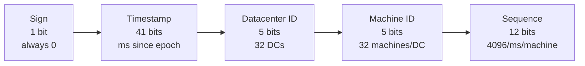

# Chapter 7: Design a Unique ID Generator in Distributed Systems

## Why `auto_increment` doesn't work here

A single database's `auto_increment` is trivial — one server, one counter. It breaks the moment there are **multiple database servers** (forced by Chapter 1's sharding or Chapter 6's partitioning): two independent servers each counting `1, 2, 3...` locally will collide the instant their output is merged. The problem: generate IDs unique *across* machines, without those machines coordinating on every single ID.

## Requirements

- IDs must be **unique**.
- IDs are **numeric only**.
- IDs fit in **64 bits**.
- IDs are **ordered by time** (not necessarily +1 — just: a later ID is always numerically larger).
- Support **10,000+ IDs/second**.

## Four candidate approaches

### 1. Multi-master replication
Use each DB's native `auto_increment`, but increment by **k** (number of DB servers) instead of 1. 2 servers → server A: `1,3,5,7...`; server B: `2,4,6,8...` — no collisions possible.

**Cons:** hard to scale across multiple data centers; IDs **don't** monotonically increase with time *across* servers (breaks the ordering requirement); adding/removing a server means changing k and reshuffling the whole scheme — same flavor of pain as naive `hash % N` rehashing (Chapter 1).

### 2. UUID
A 128-bit identifier generated **independently on each machine, zero coordination**. Collision odds are negligible (1 billion UUIDs/sec for ~100 years → only 50% chance of one collision, per Wikipedia).

**Pros:** trivially simple, no synchronization, scales effortlessly with however many web servers exist.
**Cons (disqualifying here):** 128 bits (need 64), not time-ordered, can be non-numeric. Fails 3 of 5 requirements despite being operationally the easiest.

### 3. Ticket server
Centralize `auto_increment` onto **one dedicated database** ("ticket server"); everything else asks it for the next ID (Flickr's original approach).

**Pros:** numeric, simple, fine at small/medium scale.
**Cons:** a **single point of failure** — exactly what Chapter 1's load balancing and Chapter 6's decentralized architecture exist to eliminate. Adding more ticket servers for redundancy just reintroduces multi-master replication's coordination problem.

### 4. Twitter Snowflake — the chosen approach

**Divide and conquer**: split the 64-bit ID into sections, each independently solving one piece of uniqueness/ordering.

```
[ 1 bit sign | 41 bits timestamp | 5 bits datacenter ID | 5 bits machine ID | 12 bits sequence ]
```

| Section | Bits | Purpose |
|---|---|---|
| Sign | 1 | Always 0 — keeps the ID positive as a signed 64-bit int |
| Timestamp | 41 | ms since a custom epoch (Twitter default: Nov 4, 2010). Highest-order field after sign → later timestamp always = larger ID, giving time-ordering for free |
| Datacenter ID | 5 | 2⁵ = 32 possible data centers |
| Machine ID | 5 | 2⁵ = 32 machines per data center |
| Sequence number | 12 | 4,096 values/ms per machine; increments per ID generated in the same ms on the same machine, resets to 0 each new ms |

**How uniqueness is achieved without coordination**: every machine has a fixed, unique `(datacenter_id, machine_id)` pair assigned once at startup. Two different machines can never collide — even generating at the same millisecond — because that pair differs. Within one machine, the sequence number disambiguates same-millisecond IDs. **Datacenter ID and machine ID are fixed config, chosen at startup**; only timestamp and sequence number are generated live. An accidental duplicate `(datacenter_id, machine_id)` assignment is the failure mode to guard against operationally.



## The deep-dive math

**Timestamp lifespan** (41 bits): max value `2⁴¹ − 1 = 2,199,023,255,551` ms.
```
2,199,023,255,551 ms ÷ 1000 = ~2.199 billion seconds
÷ 3600 ÷ 24 ÷ 365 ≈ ~69.7 years
```
The generator works for **~69 years** from its epoch before this field overflows. This is why a **custom epoch** (2010) beats the standard Unix epoch (1970) — every year already elapsed before your chosen epoch is runway thrown away. An epoch near actual launch date buys the full ~69 years.

**Throughput per machine** (12-bit sequence): `4,096 IDs/ms × 1,000 ms/s = 4,096,000 IDs/second per machine` — over 400× the system-wide requirement of 10,000 IDs/sec. Huge headroom, and machines can be added freely with zero request-time coordination, since uniqueness is structural (datacenter/machine ID), unlike Ticket Server or Multi-master Replication.

## Comparison summary

| Approach | Numeric | 64-bit | Time-ordered | No SPOF | No cross-machine coordination |
|---|---|---|---|---|---|
| Multi-master replication | ✅ | ✅ | ❌ | ✅ | ❌ (needs offset scheme) |
| UUID | ❌ | ❌ (128-bit) | ❌ | ✅ | ✅ |
| Ticket server | ✅ | ✅ | ✅ | ❌ | ❌ (single server) |
| **Snowflake** | ✅ | ✅ | ✅ | ✅ | ✅ |

## Wrap-up talking points

- **Clock synchronization** — the whole scheme assumes each machine's clock always moves forward. A backward jump (NTP correction, VM drift) could break ordering or risk a collision. NTP is the standard real-world fix; not solved in depth here, just flagged.
- **Section length tuning** — 41/5/5/12 isn't fixed law. Low-concurrency, long-lived applications might shrink sequence bits and grow timestamp bits for longer runway before overflow — a legitimate, defensible design knob to raise in an interview.
- **High availability** — every write in the system needs an ID, making this mission-critical infrastructure. Snowflake's payoff: since no machine coordinates with any other at request time, one machine's generator going down never takes any other machine's generation offline — the property Ticket Server's SPOF couldn't offer.

## Reference materials
- Universally unique identifier: https://en.wikipedia.org/wiki/Universally_unique_identifier
- Ticket Servers: Distributed Unique Primary Keys on the Cheap (Flickr): https://code.flickr.net/2010/02/08/ticket-servers-distributed-unique-primary-keys-on-the-cheap/
- Announcing Snowflake: https://blog.twitter.com/engineering/en_us/a/2010/announcing-snowflake.html
- Network Time Protocol: https://en.wikipedia.org/wiki/Network_Time_Protocol

## My open questions / follow-ups
- *(add doubts here as they come up)*
